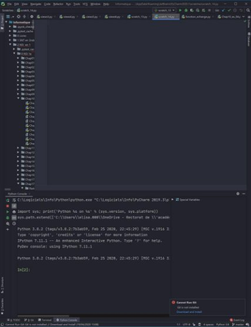
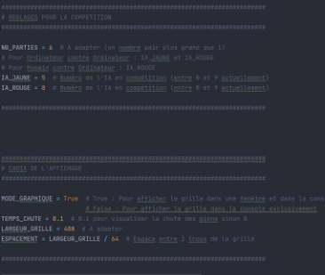
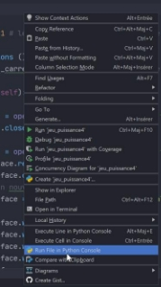
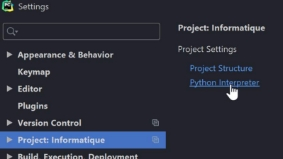
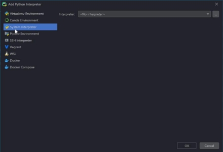
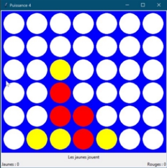

---
author: ELP
title: Installation et premiers pas
---

Nous utilisons parfois des outils en ligne permettant de travailler directement dans le navigateur et simplifiant considérablement l'échange de documents :[ repl.it ](https://repl.it/) et[ basthon.fr  ](https://basthon.fr/)

## **1.  Installation** 

### **1.1. Sous Windows – à la maison.** 
1. Sous Windows, pour installer Python avec l’**environnement de développement IDLE**, il suffit de télécharger qui se trouve sur le site officiel :[ https://www.python.org/downloads/windows ](https://www.python.org/downloads/windows)(ce ne sera peut-être pas la même version que sur la procédure) 
2. Pour l’installer, suivre la méthode donnée.  


3. Une fois installé, faire un raccourci vers l’IDLE et un raccourci vers l’interpréteur. Ils se trouvent sur Démarrer → Programmes → Python. Prendre chacun et l’amener sur le bureau 


### **1.2. Sous Linux** 

Python 3 est pré-installé sur la plupart des distributions Linux. 

## **2. Les différents IDE et quelques logiciels à installer** 

On vient d’installer **l’IDLE (c’est le minimum pour débuter en Python)**. Mais il existe d’autres IDE (IDE en anglais : Integrated Development Environment) bien plus performants et qui vous permettront d’aller plus loin. Petite présentation d’une liste d’autres environnements de travail par ordre décroissant de préférence 

### **2.1. IDLE** 

IDLE est l’environnement de développement intégré (IDE en anglais : Integrated Development Environment) proposé par Python : c’est le minimum pour débuter en Python. IDLE propose un certain nombre d’outils : 

- un éditeur de texte (pour écrire le programme) 
- un interpréteur (pour exécuter le programme) 
- un débogueur (pour tester le programme) 
### **2.2. Thonny**

Thonny est un environnement de développement intégré (IDE) pour le développement en Python. Il a été conçu pour être utilisé par les débutants en programmation, en particulier les étudiants et les enseignants. Il offre une interface utilisateur simple et facile à utiliser, ainsi qu'une variété de fonctionnalités pour aider les débutants à apprendre à coder en Python. 

**Avantages :** 

- Interface utilisateur conviviale : Thonny a une interface utilisateur très intuitive et facile à utiliser, avec des icônes claires et des menus simples. 
- Debugging intégré : Thonny offre un système de débogage puissant qui peut aider les débutants à comprendre comment résoudre les erreurs de code. 
- Assistance pour la saisie de code : Thonny offre une aide contextuelle pour la saisie de code, ce qui peut aider les débutants à comprendre les différentes fonctionnalités de Python. 
- Fonctionnalités d'enseignement : Thonny a été conçu pour les enseignants, et il inclut des fonctionnalités pour les aider à enseigner le développement en Python. 

**Inconvénients :** 

- Moins de fonctionnalités que les autres IDE : Thonny a été conçu pour les débutants, donc il offre moins de fonctionnalités que d'autres IDE plus avancés pour Python. 

### **2.3. Pycharm** 

**PyCharm** est le meilleur IDE tout simplement. Sa version gratuite est très complète et répond à tous les besoins d'un développeur Python. 

PyCharm est un **environnement de développement intégré** (IDE = integrated development environment) utilisé pour programmer en Python.  

La première version de PyCharm a été publiée en juillet 2008. C'est JetBrains qui a développé Pycharm (JetBrains aussi connu pour avoir développé IntelliJ - Java).  

Il est **multiplateforme** et fonctionne sur Windows, Mac OS X et Linux. Il est disponible en trois versions, la **version Community** sous licence Apache, la **version Educational** (Edu) et la **version Professional** sous licence propriétaire. Les deux premières versions sont open source, donc **gratuites** alors que la version Professional est payante.  

La **version Community,** celle qui nous intéresse, possède différentes fonctionnalités telles que la coloration syntaxique,  l'autocomplétion  ou  encore  la  vérification  de  code  en  direct.  La  version  payante  possède évidemment des fonctionnalités que les versions gratuites ne possèdent pas telles que la gestion complète de  bases  de  données  ou  encore  une  panoplie  de  framework  plus  importante  que  sur  la  version communautaire.  

Vous pouvez télécharger Pycharm à cette adresse :[ https://www.jetbrains.com/pycharm/ ](https://www.jetbrains.com/pycharm/)

Évidemment on **installe la version Community** c’est celui qu’on utilisera le plus souvent pour Python en classe. 

### **2.4. Visual Studio Code ou VSC** 


Il  permet  de  faire  du  développement  sur  Python,  mais  également  sur  d’**autres  langages**.  Nous  l’utiliserons notamment pour écrire du **HTML, JavaScript, CSS**, … 
**VS code** est un éditeur de code extensible développé par Microsoft pour Windows Linux et OS X. A ne pas confondre avec Visual Studio, VS code est petit, mais complet et **open source**. Il est aussi très facilement configurable et extensible avec son système d’extension.  
VS code est construit sur Electron, il présente donc les mêmes avantages et inconvénients.  
Du côté des fonctionnalités, on retrouve **un moteur d'autocomplétion** de code puissant (IntelliSense), une **console**
**de** débogage ainsi qu'un terminal pour lancer les commandes serveur.  
Pour finir VS Code se classe en tête des projets avec le plus grand nombre de contributeurs sur la plateforme GitHub et montre qu'il fait partie des éditeurs à part entière.  
Vous pouvez télécharger Visual Studio Code à cette adresse :[ https://code.visualstudio.com/ ](https://code.visualstudio.com/)

### **2.5. Notepad++** 

Il s’agit de la version améliorée du bloc-notes de Windows. Il permet donc **d’ouvrir tous les fichiers** de différents langages. Il propose la **coloration syntaxique** et **l’auto indentation**. 

### **2.6. Autres logiciels IDE** 

Il existe une tripotée d’IDE pour Python qui est parfois spécialisée dans certains types de codage (par exemple, pour les DataSciences il vaut mieux Jupyter qui est plus adapté à cette utilisation)  

### **2.7. Autres logiciels** 

Nous aurons besoin d’autres logiciels gratuits lors de l’étude des serveurs, du langage C, Linux via une virtualisation, des bases SQL (en terminale)… mais ils vous seront proposés à installer en **temps voulu.** 

## **3. Interpréteur** 

Beaucoup de commandes peuvent être testées dans l’interpréteur Python. Par exemple,  

``` 3 + 2 ```

<!-- Dans la suite du cours les commandes à tester dans l’interpréteur sont dans des rectangles sur fond noirs et commence par un prompt >>> -->

L’interpréteur de l’IDLE : 


L’interpréteur de Pycharm : 



## **4. L’éditeur de Pycharm** 

Un programme est une séquence d’instructions. Dans le cas d’un programme en langage Python, on parle souvent de **script Python**. Un script se présente sous la forme d’un fichier texte avec l’extension **.py** 

Pour écrire des scripts, on va utiliser IDLE (ne pas oublier fichier new) ou l’éditeur de Pycharm. 

Exemple de script Python : jeu\_puissance4.py 

Ouvrir Pycharm (ou l’IDLE) et faire file > open  et ouvrir le fichier jeu\_puissance4.py (dans Ressources) L'éditeur de texte s’ouvre avec le code source du script (environ 1000 lignes de code, soit plusieurs dizaines d’heures de travail pour un développeur expérimenté) : 



Pour exécuter le script :  

- Dans Pycharm : bouton droit de la souris et  



- Dans l’IDLE : Run → Run module (ou touche F5) 

Sur Pycharm il a tendance à perdre d’environnement de travail et donc le programme Python Si problème : File > Settings 

Project > Python Interpreter 







Comme on l’a installé dans **C:\Python => pas de problème**


On valide 

A vous de jouer ! 



## **5. Python et les caractères accentués** 

Par défaut, Python 2 ne gère pas les caractères accentués dans les scripts. La version 3 de python résout ce problème en  autorisant  la  majorité  des  caractères  courants.  Cependant,  **évitez  d’utiliser  des  variables  contenant  des caractères spéciaux**, réservez-les aux chaines de caractères. 


On prendra donc soin d’insérer en haut de chaque script (par exemple : exemple.py) **l’encodage suivant** : 

```# coding=utf-8 ```

Oui, il est précédé d’un # et donc parait être un commentaire, mais les premières lignes sont interprétées comme des réglages. 

On trouvera souvent le préambule suivant : 

```python
#!/usr/bin/env python 
# coding=utf-8 
```

ou 
```#! /usr/bin/python```
Cette première ligne, appelée **SHEBANG**, permet au système d’exploitation Linux de reconnaître un script exécutable. 

De manière générale, on recommande **d'éviter les accents, cédilles,** etc. dans les codes sources. C’est parfois impossible, aussi doivent-ils être traités avec prudence en définissant un encodage. 

Comme dans jeu\_puissance4.py on prend le soin de noter le titre, le codeur, la date (moins de soucis dans les versions de python par la suite) et une description (ici explication de ce qu’on peut faire avec le fichier) : 

""" ######################################################################## # 

- Puissance 4 - Humain contre Ordinateur avec IA 

\# 

- Copyright 2016-2019 - Eric Sérandour 
- Version du 14 octobre 2019 à 23 h 17 

\# 

- This program is free software; you can redistribute it and/or 
- modify it under the terms of the GNU General Public License as 
- published by the Free Software Foundation; either version 3 of 
- the License, or (at your option) any later version. 

\# 

- This program is distributed in the hope that it will be useful, 
- but WITHOUT ANY WARRANTY; without even the implied warranty of 
- MERCHANTABILITY or FITNESS FOR A PARTICULAR PURPOSE.  See the 
- GNU General Public License for more details. 

\# 

- You should have received a copy of the GNU General Public 
- License along with this program; if not, write to the Free 
- Software Foundation, Inc., 51 Franklin Street, Fifth Floor, 
- Boston, MA 02110-1301, USA. 

\# 

Première NSI   Chap 8 : Installation et premiers pas avec Python  Page 8/9 

## 6. **Que faut-il faire ?**  

Pour chaque chapitre, créez un fichier resume\_ch02.py, resume\_ch03.py, … avec l’éditeur Python 

Ne pas oublier # coding=utf-8, le titre, la date et l’auteur 

Pour  chaque  commande  testée  dans  l’interpréteur  ou  dans  l’éditeur  complétez  votre  script resume\_ch02.py, resume\_ch03.py, …avec les nouvelles commandes apprises : **c’est l’équivalent d’une fiche de cours, il faut donc** 

**en prendre soin** 

Pour chaque série d’exercices (à la fin des cours) : réalisez chaque exercice dans un fichier nommé dans l’éditeur Python : exo\_ch02\_01.py, exo\_ch02\_02.py, exo\_ch02\_03.py,…… 

## 7. **Conseils**  

Nouveauté : on essaie cette année de travailler sur le TSE à distance et en classe => comme cela vous aurez toujours votre travail sur vous !! 
Première NSI   Chap 1 : Installation et premiers pas avec Python  Page 9/9 
