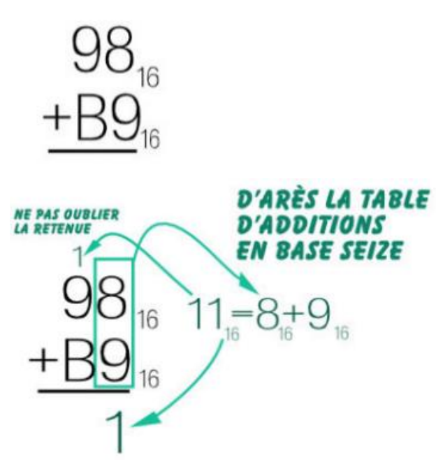
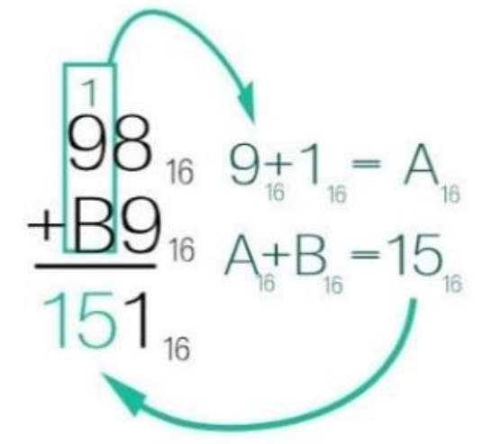
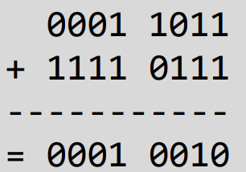
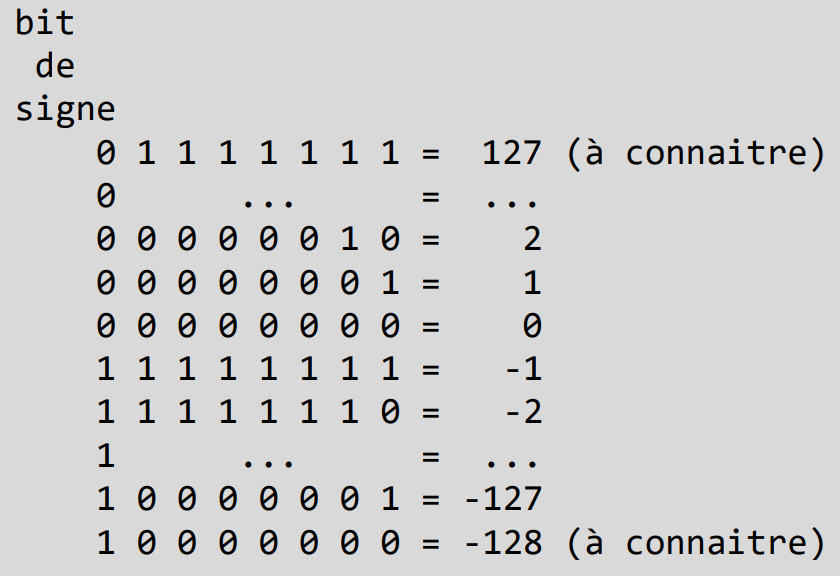
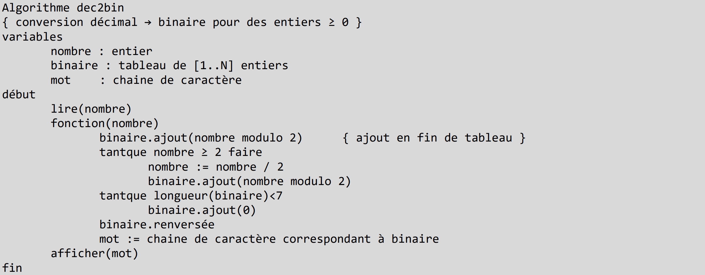
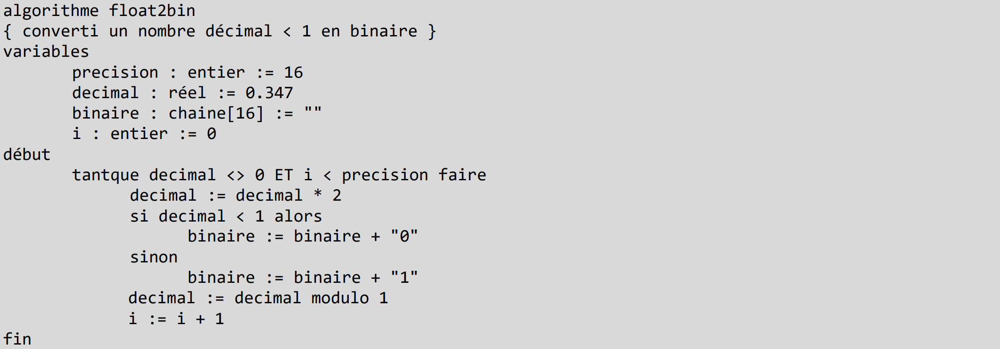
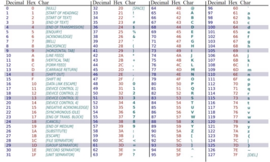

---
author: ELP
title: Chapitre 4 - Codage de l'information
---


**Table des matières** 

1. [Vocabulaire ](#_page0_x40.00_y610.92)
2. [Les bases courantes](#_page1_x40.00_y467.92)
3. [Le codage des nombres entiers signés en binaire](#_page5_x40.00_y574.92)
4. [Exercices](#_page9_x40.00_y36.92)
5. [Représentation des nombres réels](#_page12_x40.00_y36.92)
6. [Exercices](#_page15_x40.00_y36.92)
7. [Codage des caractères](#_page16_x40.00_y36.92)
8. [Représentation des images](#_page17_x40.00_y448.92)
9. [Exercices](#_page18_x40.00_y36.92)


## **1. Vocabulaire<a name="_page0_x40.00_y610.92"></a>** 

La mémoire des ordinateurs est constituée d’une multitude de petits circuits électroniques qui ne peuvent être, chacun, que dans **deux états conventionnellement appelés 0 et 1**, (1, y'a du courant, 0, y'en a pas), mais on aurait pu tout aussi bien les appeler faux et vrai.  

0, ou 1 s’appelle :  
- un booléen,  
- ou un chiffre binaire  
- ou encore un bit (binary digit).  

Un tel circuit à deux états s’appelle un **circuit mémoire un bit.**  

Toute l’information traitée par un ordinateur est en binaire.  

Le **bit** (b minuscule dans les notations) est la plus petite unité d'information manipulable par une machine numérique. 

Il est possible de représenter physiquement cette information binaire par un signal électrique ou magnétique, qui, au- delà d'un certain seuil, correspond à la valeur 1.  

L'**octet** (en anglais **byte** ou B majuscule dans les notations) est une unité d'information composée de **8 bits**. Il permet par exemple de stocker un caractère comme une lettre ou un chiffre. 

Une  unité  d'information  composée  de  16  bits  est  généralement  appelée  **mot**  (en  anglais  word).  Une  unité d'information de 32 bits de longueur est appelée mot double (en anglais double word, d'où l'appellation dword). 

Beaucoup d'informaticiens ont appris que 1 kilooctet valait 1024 octets. Or, depuis décembre1998, l'organisme international IEC a statué sur la question[^1]. 

Voici les unités standardisées : 

- Un kilooctet (ko)  = 103 octets 
- Un mégaoctet (Mo)  = 106 octets 
- Un gigaoctet (Go)  = 109 octets 
- Un téraoctet (To)  = 1012 octets 
- Un pétaoctet (Po)  = 1015 octets 
- Un exaoctet (Eo)  = 1018 octets 
- Un zettaoctet (Zo)  = 1021 octets 
- Un 1yottaoctet (Yo)  = 1024 octets 

Un mégaoctet devrait en principe valoir 1000 x 1000 octets, c'est-à- dire 1.000.000 d'octets, mais il vaut 1024 x 1024 octets en informatique, c'est-à-dire 1.048.576 octets... ce qui correspond à une différence de 4,63% ! 

## **2. Les<a name="_page1_x40.00_y467.92"></a> bases courantes** 
### **2.1. La<a name="_page1_x40.00_y489.92"></a> base 10 ou base décimale** 

Elle s’appuie sur **10 « symboles »** : 0, 1, 2, 3, 4, 5, 6, 7, 8, 9. On peut ainsi compter jusqu'à 9. Et si l'on veut aller au- delà de 9, il faut changer de rang. Cela signifie que si le rang des unités est plein, il faut passer à celui des dizaines, puis des centaines, milliers… 


185 = 1 × 102 + 8 × 101 + 5 × 100 
**La position des chiffres définit la valeur associée à ce chiffre.** 

### **2.2. La<a name="_page1_x40.00_y677.92"></a> base 2 ou base binaire** 
#### **2.2.1. Le<a name="_page1_x40.00_y697.92"></a> binaire**

**Remarque** : Il faut toujours indiquer la base dans laquelle un nombre est exprimé (sauf, par usage et commodité, en base 10) : 1010<sub>2</sub> ou %1010. La base par défaut du code Python est la base 10. 

Par exemple :  

**Décimal**  0  1  2  3  4  5  6  7  8  9  10 

**Binaire**  0000  0001  0010  0011  0100  0101  0110  0111  1000  1001  1010 

#### **2.2.2. Le<a name="_page2_x40.00_y74.92"></a> binaire en Python**

**Activité n° 1.**: La fonction bin de Python donne une chaîne de caractères représentant l’écriture binaire de l’entier passé en paramètre. 

Tester
> bin(47) 

> 0b101 

???+ question "Faire ce qui est proposé"

    {{ terminal() }}

En Python on peut écrire les nombres entiers directement en binaire. Il suffit pour cela de faire précéder cette écriture par **0b**.  

#### **2.2.3. Passage<a name="_page2_x40.00_y235.92"></a> du système décimal au binaire**

**Méthode de Horner :**   

Exemple : Convertir 145 en binaire  
- 145 = 72 × 2 + 1  
- 72 = 36 × 2 + 0  
- 36 = 18 × 2 + 0    
- 18 = 9 × 2 + 0  
- 9 = 4 × 2 + 1  
- 4 = 2 × 2 + 0  
- 2 = 1 × 2 + 0  
- 1 = 0 × 2 + 1

*Sens de lecture est de bas vers le haut  

La conversion de 145 en binaire est donc : 10010001<sub>2</sub> 

**Méthode des puissances de 2** : 


Écrire 57 en base 2 (=donner sa représentation binaire). 

- 32 < 57 < 64. Donc on fait 57 = 32+25 = 25+25. On a un chiffre 1 à la position 6. 
- 16 < 25 < 32. Donc on fait 25 = 16+9 = 24+9. On a un chiffre 1 à la position 5. 
- 8 < 9 < 16. Donc on fait 9=8+1=23+1. On a un chiffre 1 à la position 4. 
- 1=20. On peut s’arrêter (dès qu’on atteint une puissance de 2). On a un chiffre 1 à la position 1. 

57 = 0b111001  

**L’algorithme des divisions successives**  


- On divise par 2 jusqu'à ce que le quotient soit 0  
- On lit les bits en montant de droite à gauche : 

167 = 0b10100111


#### **2.2.4. Passage<a name="_page2_x40.00_y722.92"></a> du système binaire au décimal**

Les nombres écrits en binaire suivent le même principe que ceux écrits en décimal mais avec les** puissances de deux.** 
Le mot de 8 bits %01101110 =  1.2<sup>6</sup> +  1.2<sup>5</sup> +  1.2<sup>3</sup> +  1.2<sup>2</sup> +  1.2<sup>1</sup> en décimale. 


Donc, quand on a un nombre binaire, **il suffit de multiplier chaque nombre qui le compose par la puissance de 2 correspondante au rang de son bit et d’additionner tous les résultats.** 

**Activité n° 2.**: La fonction int de Python donne une chaîne de caractères représentant l’écriture décimal d’un entier passé en paramètre. 

Tester
> int('01101110', 2) 

???+ question "Faire ce qui est proposé"

    {{ terminal() }}

On retrouve bien la valeur 110 précédente. 

#### **2.2.5. Addition<a name="_page3_x40.00_y258.92"></a> de deux nombres binaires** 

On procède comme avec les nombre écrit en décimal, sauf que 1 + 1 = 10. 

Exemple : 


On remarque que la somme de deux nombres binaires sur m bits et n bits donne un nombre binaire sur le plus grand nombre de bits **(m ou n) + 1 au maximum**. 

#### **2.2.6. Multiplication<a name="_page3_x40.00_y462.92"></a> de deux nombres binaires**  

Exemple :


On remarque que le produit de deux nombres binaires sur m bits et n bits donne un nombre binaire sur **m + n bits au maximum.** 

### **2.3. La<a name="_page3_x40.00_y727.92"></a> base 16 ou base hexadécimal** 
#### **2.3.1. L’hexadécimal<a name="_page3_x40.00_y747.92"></a>** 

En informatique, tout est basé sur le binaire, et étant une base d'indice 2, c'est plus aisé d'encoder les informations sur un nombre multiple de 2. On utilise donc souvent la base 16, appelé **système hexadécimal**  

**Hexa  0  1  2  3  4  5  6  7  8  9  A  B  C  D  E  F **

Décimal  0  1  2  3  4  5  6  7  8  9  10  11  12  13  14  15 

**Remarque** : Il faut toujours indiquer la base dans laquelle un nombre est exprimé (sauf, par usage et commodité, en base 10) : A9<sub>16</sub> ou $A9 ou #A9. La base par défaut du code Python est la base 10. 

#### **2.3.2. Passage<a name="_page4_x40.00_y103.92"></a> du système binaire au système hexadécimal et réciproquement**

Pour convertir un nombre binaire en base 16, **on regroupe les bits 4 à 4**, chaque groupe donnant un chiffre hexadécimal. À l'inverse, passer d'un nombre hexadécimal à sa représentation binaire se fait en remplaçant chaque chiffre pour son équivalent sur 4 bits  

Si le nombre binaire de départ n'a pas un nombre de bits multiple de 4, **il faut ajouter des zéros en tête** (ce qui ne change pas sa valeur) afin de pouvoir les regrouper 4 par 4. 

11011001<sub>2</sub> = 1101 1001<sub>2</sub> = D9<sub>16</sub>,  

7F<sub>16</sub> = 0111 1111<sub>2</sub> = 01111111<sub>2</sub>.  

À noter que la chaîne de caractères, avec Python, débute par **0x**, le **x** mettant en évidence qu’il s’agit de l’écriture décimal d’un entier. 

#### **2.3.3. Passage<a name="_page4_x40.00_y309.92"></a> du système décimal au système hexadécimal**  

**Méthode de Horner** : Pour convertir un nombre binaire en base 16, on regroupe les bits 4 à 4, chaque groupe donnant un chiffre hexadécimal.  

Exemple : Convertir 185 en hexadécimal 

- 185 = 11 × 16 + 9  
- 11 = 0 × 16 + 11 

*sens de lecture du bas vers le haut

La conversion de 185 en hexadécimal est donc : B9.
 **L’algorithme des divisions successives :** comme pour le binaire 

**Activité n° 3.**: La fonction hex de Python donne une chaîne de caractères représentant l’écriture binaire de l’entier passé en paramètre. 

Tester
> hex(185) 

> 0x7F

???+ question "Faire ce qui est proposé"

    {{ terminal() }}

#### **2.3.4. Passage<a name="_page4_x40.00_y569.92"></a> du système hexadécimal au décimal** 

Il faut remplacer les lettres par les nombres correspondants : 

- un A, on le remplace par un 10 
- un C, on le remplace par un 12 
- un D, on le remplace par un 13 
- un E, on le remplace par un 14 
- un F, on le remplace par un 15 

Le principe est le même que pour la conversation "binaire en décimal"  

Par exemple : 

12B7<sub>16</sub> = 1 × 16<sup>3</sup> + 2 × 16<sup>2</sup> + 11 × 16<sup>1</sup> + 7 × 16<sup>0</sup> = 1 × 4096 + 2 × 256 + 11 × 16 + 7 = 4791. 


**Activité n° 4.**: La fonction int de Python donne une chaîne de caractères représentant l’écriture décimal d’un entier passé en paramètre. 

Tester
> int('12B7', 16) 

???+ question "Faire ce qui est proposé"

    {{ terminal() }}

#### **2.3.5. Addition<a name="_page5_x40.00_y90.92"></a> de deux nombres en base 16** 



8<sub>16</sub> + 9<sub>16</sub> = une seizaine et un 
C’est-à-dire on pose 1 et on retient le 1 de la seizaine 



Ce nombre 151 en hexadécimal se lirait donc "une seizaine-carré cinq seizaines et un". D'ou le calcul en base 10 : 1x16x16 + 5x16 + 1 = 256 + 80 + 1 soit  337 en base 10 Ainsi le nombre 151 exprimé en hexadécimal est le même nombre que 337 en base 10 

On pouvait aussi convertir les deux nombres en binaire et faire leur addition. 

### **2.4. Une<a name="_page5_x40.00_y421.92"></a> base quelconque** 

Par exemple la représentation de base cinq de 58 


Donc, 58 objets se regroupent en 11 paquets et 3 unités, puis les 11 paquets se regroupent en 2 paquets de paquets et 1 paquet. 

58 = 2 × 5² + 1× 5<sup>1</sup> +3 × 5<sup>0</sup>. Donc 58 = 213<sub>5</sub>. 

## **3. Le<a name="_page5_x40.00_y574.92"></a> codage des nombres entiers signés en binaire** 

Un entier naturel est appelé **entiers non signés.** En Python, on ne manipule que des **entiers relatifs.** 

**Entiers naturels** : entiers positifs ou nuls (0, 1, 2 etc.) 

**Entiers relatifs** : entiers de n’importe quel signe (…, -2, -1, 0, 1,…) 

### **3.1. Principe<a name="_page6_x40.00_y773.92"></a> du complément à 2<sup>n</sup> :**

#### **3.1.1. De<a name="_page7_x40.00_y36.92"></a> décimal vers binaire : Pour un entier positif**

- coder l’entier en binaire comme d’habitude, 
- compléter l’octet avec des 0 devant. 

Exemple : pour 27  

- coder l'entier en binaire comme d'habitude : 27 = 0b11011 
- compléter l'octet avec des 0 devant : 27 = 0b 0001 1011 

Le complément à 2 sur un octet de 27 est 0b 0001 1011 

#### **3.1.2. De<a name="_page7_x40.00_y158.92"></a> décimal vers binaire : Pour les entiers négatifs** 
- Coder la valeur absolue du nombre en base 2, 
- compléter l’octet avec des 0 devant, 
- échanger tous les bits (1↔0), 
- ajouter 1. 

Exemple pour -9 : 

- coder la valeur absolue du nombre : 9 = 0b1001 
- compléter l'octet :   0b 0000 1001 
- échanger tous les bits :  0b 1111 0110 
- ajouter 1 :   0b 1111 0111 

Le complément à 2 sur un octet de −9 est 0b 1111 0111 

#### **3.1.3. Addition<a name="_page7_x40.00_y335.92"></a> de deux nombres binaires** 

Vérifions : 27+(−9)=18



On vérifie immédiatement que 18 = 0b10010 

**Remarque** la dernière retenue (tout à gauche) disparait. 

#### **3.1.4. De<a name="_page7_x40.00_y496.92"></a> binaire vers décimal : Pour les entiers négatifs** 

Si l’entier est négatif (si premier bit est 1) 
- On échange tous les bits 0↔1, 
- On ajoute 1, 
- On convertit en binaire comme d’habitude, 
- On change le signe. 

Exemple : 0b 1111 0111 

- On échange tous les bits, 
0b 0000 1000 
- On ajoute 1, 
0b 0000 1001 
- On convertit en binaire comme d'habitude, 0b 1001 = 1 \* 1 + 1 \* 8 = 9 
- On change le signe. 
0b 1111 0111 = -9 

### **3.2. Table<a name="_page7_x40.00_y758.92"></a> de valeurs** 




## **4. Exercices<a name="_page9_x40.00_y36.92"></a>** 

**Exercice 1 :** ★ On suppose toujours nos entiers encodés sur un octet. 

- Donner la représentation binaire 12, 100 et 88 
- Réaliser l’addition binaire bit à bit de ces 3 nombres. 

**Exercice 2 :** ★ On suppose toujours nos entiers encodés sur un octet. Donner les compléments à 2 de -12, -100 et -88. 

**Exercice 3 :** ★

- Réaliser l’addition binaire des compléments à 2 des nombres 12 et -100. 
- Vérifier qu’on retrouve bien le résultat précédent pour -88. 

**Exercice 4 :** ★ Donner les notations décimales des binaires signés sur un octet suivant : 

- 0b1111 1111 
- 0b1000 0000 
- 0b0111 1111 
- 0b1010 0011 

**Exercice 5 :** Conversion décimal – binaire 

###### 1. ★ Écrire un programme qui convertisse un nombre décimal en binaire. Utiliser une fonction dec2bin. On donne l’algorithme suivant : 




**Aide :**  

- la méthode renversée avec reverse()[ https://www.geeksforgeeks.org/python-list-reverse/ ](https://www.geeksforgeeks.org/python-list-reverse/)ou avec slicing inverse : binaire[::-1]
- pour transformer la liste en chaine de caractère : 
```mot=''.join(str(element) for element in binaire) ```

Tout au début du programme, ne pas oublier cette ligne : # coding: utf-8

###### 2. Indiquer l’utilité de cette ligne. 
###### 3. Donner la conversion de 1843 en binaire2. 
###### 4. Convertir -2 et conclure. 
###### 5. ★★★ Modifier le programme pour coder un nombre négatif selon la méthode du complément à 2. 

**Aide :** 

- Le complément à 2 peut être calculer par une autre méthode : Sur 8 bits, -88 en complément à 2 correspond au nombre binaire suivant : 

* 2<sup>7</sup> – 88 = 40 

* 40 en binaire => 010 1000 
Le bit de signe donne donc 1010 1000 

- Faire une deuxième fonction dec2bin\_negatif qui teste si le nombre entré est positif ou négatif et qui fait appel à la première fonction codée 


###### 6. Convertir -1 pour un codage sur un mot et conclure. 
###### 7. Convertir -1.1 et conclure. 

Pour éviter que le programme « crash » sur une erreur de valeur d’entrée (ValueError), une façon de gérer cette erreur est d’intercepter le message d’erreur et de le traiter correctement à l’aide des instructions try et except. 

La syntaxe est la suivante : 

```
try:
    # bloc d’instructions à exécuter
except ValueError:
    # afficher « erreur de valeur »
```

###### 8. ★★ Modifier le programme précédent en conséquence. 
###### 9. ★★Faire une boucle infinie pour que le programme demande un autre nombre tant que la valeur n’est pas un entier relatif 
###### 10. Vérifier la cohérence et la stabilité du programme avec quelques tests : 1, -1, 0, 1.1, -1.0, a 

**Exercice 6 :** Conversion hexadécimal – binaire

1 ★★★ Écrire un programme hex2dec qui convertisse un nombre hexadécimal en décimal non signé. !

**Aide :**  
- On utilisera une chaîne : chaine = "0123456789ABCDEF"

- Et on pourra utiliser la méthode index()[ https://www.geeksforgeeks.org/python-list-index/ ](https://www.geeksforgeeks.org/python-list-index/)

2 Donner les conversions de 1, A, a et A5 en décimal. 
3 Donner la conversion de AZ et conclure. 
4 Modifier votre programme comme précédemment pour gérer des erreurs éventuelles (bugs). 

NB : on affichera « valeur héxadécimale incorrecte » 

On souhaite réutiliser le code de programme dec2bin pour écrire un programme hex2bin qui convertisse un nombre hexadécimal en binaire. Pour cela, il « suffit » de récupérer la valeur obtenue par hex2dec et la passer à dec2bin. 

**On prototype** une fonction en indiquant son nom, le type des éventuels paramètres et de la valeur renvoyée le cas échéant. 

Exemple pour une fonction qui calcule le carré d’un nombre et renvoie la valeur trouvée : 

```python
def carre(nombre : int) -> int:     
    return nombre \*\* 2 
```

5 Dans le programme hex2bin, faire un copier/coller du code du programme dec2bin. 
6 ★★ Remodeler (refactor) le code pour le transformer en fonction dont le prototype sera le suivant : 
```dec2bin(nombre : int, nbits : int) -> list ```

- nombre est le nombre décimal à convertir 
- nbits est le nombre de bits 
- la fonction renvoie la conversion sous forme d’une liste binaire (au lieu de l’afficher) 

7 Tester la fonction en l’appelant depuis le corps principal (main) du programme. 

**Aide** :  
   - Juste après la fonction : print(dec2bin(501, 10))

   - vérifier que l’on obtient [0, 1, 1, 1, 1, 1, 0, 1, 0, 1]

8 A la suite de cette fonction, faire un copier/coller du code du programme hex2dec.

9 ★★ Remodeler (refactor) le code pour le transformer en fonction dont le prototype sera le suivant : 
```hex2dec(hexa : str) -> int ```

- hexa est le nombre hexadécimal à convertir 
- la fonction renvoie la conversion sous forme d’un nombre décimal 

10 Tester la fonction en l’appelant dans le corps principal (main) du programme. 

**Aide** :  
- Juste après la fonction : print(hex2dec('AF'))

- vérifier que l’on obtient 175

11 ★★ Enchaîner les appels successifs pour afficher la valeur binaire sur 8 bits des nombres suivants : 1, A et A5. 

12 Donner la conversion de AZ et conclure. 

Traiter l’erreur en local a ses limites : il faut faire remonter l’erreur vers les couches supérieures. La dernière couche traitera en dernier l’erreur selon des spécifications bien précises. 

13 ★★ Modifier les fonctions hex2dec et dec2bin pour qu’elles renvoient « None » au lieu d’afficher une erreur.  

Syntaxe : 

```
try:
    # bloc d’instructions à exécuter
except :
    return None
```

NB : L'objet Python None, exprime l'absence de valeur. Cet objet n'a aucune méthode. 

14 ★★ Modifier le corps principal du programme pour tester la valeur de retour sur chaque fonction appelée. En cas d’erreur (valeur None), afficher le message d’erreur . 
15 Créer un docstring pour chacune des fonctions du programme hex2bin. 

Syntaxe, par exemple : 

```python
def fonction (x : int, y : int) -> tuple:     
    """
    fonction qui …
    :param x: int
    :param y: int
    :return: tuple
    """
```

Convertisseur en ligne :[ https://www.exploringbinary.com/twos-complement-converter/ ](https://www.exploringbinary.com/twos-complement-converter/)

QCM :[ http://www.scientillula.net/MPI/fex6_conversions/fex6_conversions.html ](http://www.scientillula.net/MPI/fex6_conversions/fex6_conversions.html)QCM 2 :[ http://fabrice.sincere.free.fr/qcm/qcm.php?nom=qcm_numerique](http://fabrice.sincere.free.fr/qcm/qcm.php?nom=qcm_numerique)

## **5.  Représentation des nombres réels<a name="_page12_x40.00_y36.92"></a>** 

En base 10, l’expression 652,375 est une manière abrégée d’écrire : 

6.10<sup>2</sup> + 5.10<sup>1</sup> + 2.10<sup>0</sup> + 3.10<sup>−1</sup> + 7.10<sup>−2</sup> + 5.10<sup>−3</sup>

Il en va de même pour la base 2. L’expression 110,101 signifie : 

1.2<sup>2</sup> + 1.2<sup>1</sup> + 0.2<sup>0</sup> + 1.2<sup>-1</sup> + 0.2<sup>-2</sup> + 1.2<sup>-3</sup>

### **5.1. Conversion<a name="_page12_x40.00_y115.92"></a> de binaire en décimal** 

On peut ainsi facilement convertir un nombre réel de la base 2 vers la base 10. Par exemple : 

110,101 = 1.2<sup>2</sup> + 1.2<sup>1</sup> + 0.2<sup>0</sup> + 1.2<sup>-1</sup> + 0.2<sup>-2</sup> + 1.2<sup>-3</sup> = 4 + 2 + 0,5 + 0,125 = 6,625 

### **5.2. Conversion<a name="_page12_x40.00_y167.92"></a> de décimal en binaire** 

Le passage de base 10 en base 2 est plus subtil. Par exemple : convertissons 1234,347 en base 2. 

1. La partie entière se transforme comme précédemment : 1234<sub>10</sub> = 10011010010<sub>2</sub>
2. On transforme la partie décimale selon le schéma suivant :


On continue ainsi jusqu'à la précision désirée..

Attention ! Un nombre à développement décimal fini en base 10 ne l'est pas forcément en base 2. Cela peut engendrer de mauvaises surprises. 


### **5.3. Représentation<a name="_page13_x40.00_y36.92"></a> des flottants dans un ordinateur** 

Il est parfois nécessaire d’approximer la valeur à représenter. 
Règles de base : 

- Il ne faut jamais tester une égalité entre deux nombres flottants mais utiliser une marge d’erreur relative.  
- Il ne faut pas se fier à l’affichage de Python qui n’affiche pas toutes les décimales stockées du nombre flottant. 


**Activité n° 5.**:  
Tester :
> 0.1 
> 0.2 
> 0.1 + 0.2 
> 0.1 + 0.2 

???+ question "Faire ce qui est proposé"

    {{ terminal() }}

La norme IEEE[^2] 754 est la norme la plus employée pour la représentation des nombres à virgule flottante dans le domaine informatique. Il existe deux formats de codage :  

- le format dit "simple précision" et le format dit "double précision".  
- Le format "simple précision" utilise 32 bits pour écrire un nombre flottant alors que le format "double précision" utilise 64 bits.  

Sur 32 bits (ou 64), on utilise : 

- 1bit pour le signe,  
- 8 (ou 11) pour l’exposant  
- 23 bits (ou 52 bits) pour la mantisse. 


Conditions à respecter : 

- l'exposant 00000000 est interdit. 
- l'exposant 11111111 est interdit. On s'en sert toutefois pour signaler des erreurs, on appelle alors cette configuration du nombre NaN, ce qui signifie « Not a number ». 
- il faut commencer par écrire le nombre sous la forme : 1,XXXXX.2<sup>exposant</sup>. La partie « XXXXX » constitue la mantisse.  
- Pour le format simple précision, 8 bits sont consacrés à l’exposant, il est donc possible de représenter 256 valeurs : soit les exposants compris entre (-126)<sub>10</sub> et (+127)<sub>10</sub> c’est-à-dire 126 valeurs négatives + le zéro + 127 valeurs positives (-127 et +128 sont des valeurs réservées). 
- Pour avoir des valeurs uniquement positives, il va falloir procéder à un décalage : ajouter systématiquement 127 à la valeur de l’exposant.  

Exemple : -10,125 au format simple précision 

1ère étape : conversion en binaire du nombre relatif 

- 10<sub>10</sub> = 1010<sub>3</sub> 
- 0,125<sub>10</sub>
 0,125 x 2 = 0,250 
 0,250 x 2 = 0,50 
 0,50 x 2 = 1 + 0 (arrêt) 

- 0,125<sub>10</sub> =  0,001<sub>2</sub>  

10,125<sub>10</sub> = 1010,001<sub>2</sub> 

2ème étape : utilisation de la norme IEEE 754 

- Le bit de signe est 1 (nombre négatif) 
- On décale la virgule de trois rangs vers la gauche 1010,001 = 1,010001.2<sup>3</sup>
- On ajoute 127 à la valeur de l’exposant 1,010001.2<sup>130</sup>
- L’exposant est 130<sub>10</sub> = 10000010<sub>2</sub>
- La mantisse 010001 doit comporter 23 bits => on rajoute des zéros pour arriver à 23 


En convertissant en hexadécimal : 


[https://www.h-schmidt.net/FloatConverter/IEEE754.html ](https://www.h-schmidt.net/FloatConverter/IEEE754.html) 

## **6.  Exercices<a name="_page15_x40.00_y36.92"></a>** 

**Exercice 7** convertir en base 10  

1. 0,0101010101<sub>2</sub>  
2. 11100,10001<sub>2</sub> 

**Exercice 8 :** Convertir en binaire puis en norme IEEE-754 

1. 5,1875
2. 4,3125
3. 0,3125 

**Exercice 9** : **conversion des flottants** 

On souhaite transformer un nombre binaire décimal en base 10. Pour simplifier, on va déjà écrire un programme qui transforme la partie décimale en binaire, puis dans un deuxième temps on transformera la partie entière. 

**PARTIE I**

1 ★ Écrire un programme bin2float.py qui convertisse la partie décimale d’un nombre binaire en flottant. 

**Aide** : on pourra utiliser la méthode split() de l’objet str pour récupérer la partie décimale. On utilisera le séparateur ','. Attention ce n’est pas une méthode en place donc il faut la réaffecter :[ https://www.w3schools.com/python/ref_string_split.asp ](https://www.w3schools.com/python/ref_string_split.asp)

2 ★ Transformer 0,0101010101<sub>2</sub> et 11100,10001<sub>2</sub> en base 10. 

**Aide** : print(bin2float(nombre)) 

3 ★ Modifier le programme précédent pour créer une fonction avec le prototype suivant : 

decimale(nom\_variable\_a\_changer : str) -> float
 
- binaire : chaine binaire de la partie décimale

- la fonction doit renvoyer le nombre flottant correspondant 

4 ★ Ajouter une fonction qui convertisse en base 10 la partie entière du binaire. Le prototype est le suivant : 

entiere(nom\_variable\_a\_changer : str) -> int

5  ★ Enchaîner les appels successifs pour transformer un nombre binaire décimal en base 10. On utilisera une fonction avec le prototype suivant : 

bin2float(nombre : str) -> float


**PARTIE II** 
On souhaite maintenant réaliser l’opération inverse et transformer un flottant en binaire. Pour cela, on va encore séparer le problème en deux sous problèmes : d’abord transformer la partie décimale, puis terminer avec la partie entière. 

6 ★ Écrire un programme float2bin qui convertisse la partie décimale d’un nombre flottant en binaire. On donne l’algorithme : 



decimal <> 0 signifie différent de 0 

7 Donner la signification de l’instruction : decimal := decimal modulo 1 
8 Tester le programme. Résultat attendu : 0101100011010100. 
9 ★ Modifier le programme précédent pour créer une fonction avec le prototype suivant : 

bin\_decimal(decimal : float, precision : int) -> str

- décimal : partie décimale du nombre flottant 
- precision : précision souhaité dans le calcul 
- la fonction doit renvoyer la chaîne binaire correspondante 

10 Transformer 0,5625 et 0,15 en base 2. 
11 ★★Ajouter une fonction qui convertisse en base 2 la partie entière du nombre flottant. Le prototype est le suivant : bin\_entiere(entier :int) -> str 

**Aide** : on pourra utiliser la fonction float(),  int() et le modulo 1 

12 ★★ Enchaîner les appels successifs pour transformer un nombre binaire décimal en base 10. On utilisera une fonction avec le prototype suivant : 

float2bin(nombre : str) -> str
 
13 Transformer 12,9 en base 2.
14 ★ Créer un docstring pour chacune des fonctions du programme float2bin. 

## **7.  Codage des caractères<a name="_page16_x40.00_y36.92"></a>** 

### **7.1. Le<a name="_page16_x40.00_y58.92"></a> code ASCII**[^3]** 

La norme ASCII[^4] (on prononce généralement « aski ») établit une correspondance entre une représentation binaire des caractères de l'alphabet latin et les symboles, les signes, qui constituent cet alphabet.  

Par exemple, le caractère a est associé à 1100001 (97) et A à 1000001 (65).  

La norme ASCII permet ainsi à toutes sortes de machines de stocker, analyser et communiquer de l'information textuelle. En particulier, la quasi-totalité des ordinateurs personnels et des stations de travail utilisent l'encodage ASCII. Le code ASCII de base représentait les caractères sur 7 bits (c'est- à-dire 128 caractères possibles, de 0 à 127). 



1. L’œuvre complète de Shakespeare tient sur 5 615 776 caractères (lettres et signes de ponctuation et d’espacement). À raison d’un octet pour représenter un caractère, cela fait donc environ 5,6 mégaoctets (5,6 Mo) de texte brut. 
1. Une photo de résolution moyenne (4:3 8 mégapixel, 3264x2448) prise par un smartphone fait 19,5 kilo- octets (19,5 ko) une fois compressée. 
1. La Joconde en haute définition (HD) sur une image de 7 479 × 11 146 pixels pour une taille de fichier de 89,94 mégaoctets (89,94 Mo). 
1. Une minute de vidéo sur YouTube de qualité web pour smartphone, fait 3,1 méga-octets (3 Mo) 

**Activité n° 6.**: **Python et la table ascii** Les fonctions chr et ord permettent d’accéder à la table 

\>>> chr(65) # caractère 65 (décimal) 

'A' 

\>>> ord('A') # numéro décimal du caractère 65 

### **7.2. Les<a name="_page16_x40.00_y611.92"></a> encodages ISO-latin** 

Dans les années 1990, pour satisfaire les besoins des pays européens, ont été définis plusieurs encodages alternatifs, connus sous le nom de ISO-latin, ou encore ISO-8859.  

Idéalement, on aurait pu et certainement dû définir un seul encodage pour représenter tous les nouveaux caractères; mais entre toutes les langues européennes, le nombre de caractères à ajouter était substantiel, et cet encodage unifié aurait largement dépassé 256 caractères différents, il n'aurait donc pas été possible de tout faire tenir sur un octet. Mais on a préféré préserver la "bonne propriété" du modèle un **caractère = un octet**, ceci afin de préserver le code existant qui aurait sinon dû être retouché ou récrit. 

Dès lors il n'y avait pas d'autre choix que de définir plusieurs encodages distincts; par exemple pour le **français** on a utilisé à l'époque **ISO-latin-1**; pour le russe ISO-latin-5. 

### **7.3. Unicode<a name="_page17_x40.00_y54.92"></a>** 

Il existe d'autres normes que l'ASCII, comme l'Unicode par exemple, qui présentent l'avantage de proposer une version unifiée des différents encodages de caractères complétant l'ASCII mais aussi de permettre l'encodage de caractères autres que ceux de l'alphabet latin. Unicode définit des dizaines de milliers de codes, mais les 128 premiers restent compatibles avec ASCII. 

Dans le codage UTF-8, chaque point de code est codé sur une suite d'un à quatre octets. Il a été conçu pour être compatible avec certains logiciels originellement prévus pour traiter des caractères d'un seul octet. 

Toutes  ces  normes  différentes  et  leurs  incompatibilités partielles sont la cause des problèmes que l'on rencontre parfois  avec  les  caractères  accentués.  C'est  pour  cette raison  qu'il  vaut  mieux,  quand  on  écrit  des  courriels  à l'étranger, n'utiliser que des caractères non accentués. 

**Martine écrit en UTF-8** :  

- La lettre é a été encodée en **UTF-8** (parce que 2 caractères sont affichés) 
- En mémoire elle occupe 2 octets (elle n’est pas dans la table ascii) 
- Ces deux octets ont été décodés en iso-latin1 (1 octet par caractère). 

## **8. Représentation<a name="_page17_x40.00_y448.92"></a> des images**

Une image peut être vue comme un quadrillage  rempli d'une multitude de petits cases appelées  pixels.  

Chaque pixel est un carré d'une couleur définie.  Cette  couleur  se  code  à  l'aide  d'une  combinaison de trois couleurs de base : rouge,  vert  et  bleu  (Red,  Green,  Blue  en  anglais  -  souvent  abrégé  en  RGB).  Chacune  des  trois  couleurs étant codée sur 8 bits, soit entre 0 et  255.  

Ainsi, le pixel grisé désigné sur la photo est codé comme la  combinaison de 174 de rouge (Red), 181 de vert (Green) et  190 de bleu (Blue). Chacun de ces trois nombres étant codé  sur 8 bits, il faut 3x8=24 bits au total pour coder un pixel.  En codant ainsi chaque pixel de l'image originale, on peut  ainsi traduire une image en série de bit. Et inversement, on  peut  reconstituer  une  image  à  partir  d'une  série  de  bits  donnée.  

## **9. Exercices<a name="_page18_x40.00_y36.92"></a>** 

**Exercice 10 :** Image matricielle 

L’objectif de cet exercice est de dessiner une image matricielle dans le quadrillage 8x8 en page 1, ci-dessous, grâce à vos réponses aux différentes questions de conversions entre les bases numériques. 

Chaque case de l’image correspond à un bit. Une ligne de l’image fait 8 cases, soit 8 bits, soit 1 octet. Pour remplir les cases de l’image, vous devrez donc passer par la valeur binaire de la conversion afin de pouvoir appliquer cette règle de coloriage, même si la réponse n’aboutit pas à du binaire. Lorsque le bit est à 1 alors la case est noire, lorsque le bit est à 0 alors la case est blanche. 

Exemple : 


Ligne Valeur binaire correspondante Valeur décimale correspondante Valeur hexadécimale correspondante 
 -  :-  -  :-:  :-  :-  :-  :-  :-  :-  :-  :-  :-  :-  :-  :-  :-  :-  :-  :-  :-  :-  :-  :- 
0b10010101 149 0x95 

Quadrillage pour l’image matricielle de 8x8 : 


Pour la question 1 
 :-  :-  :-  :-  :-  :-  :-  :-  - 
* *   Réponse à la question 2 
    Réponse à la question 3 
Pour la question 4 
  Réponse à la question 5 
    Réponse à la question 6 
Réponse à la question 7 
Réponse à la question 8 

**Traduire** la première ligne de l’image en valeur en binaire. 

1. **Convertir** la valeur binaire de la première ligne en décimal : 
1. **Convertir** la valeur hexadécimale 0x66 en binaire : 
1. **Convertir** la valeur hexadécimale 0x3C en décimal : 
1. **Convertir** la valeur binaire de la ligne N°4 en hexadécimal : 
1. **Convertir** la valeur décimale 24 en binaire : 
1. **Convertir** la valeur décimale 60 en hexadécimal : 
1. **Colorier** la ligne N°7 de l’image avec la valeur binaire suivante :  **0b01100110**
1. **Convertir** la valeur binaire 0b11111111 en hexadécimal : 

RAPPELS :   Un nombre binaire s’écrit ainsi : **1011(2)** ou **0b1011** ou **%1011** ou **1011b**

Un nombre hexadécimal s’écrit ainsi : **9A(16)** ou **0x9A** ou **$9A** ou **9Ah **

Première NSI   Chap 20 : Codage de l’information  Page 20/21 

**Exercice 11** L’heure en binaire ????  

Cette montre affiche l’heure en binaire :  

- une ligne affiche les minutes,  
- une autre ligne affiche les heures.  
1. Quelle est la valeur maximale en décimal que peut afficher la ligne  du haut ? en binaire ? en hexadécimal ?  
1. Quelle est la valeur maximale en décimal que peut afficher la ligne  du bas ? en binaire ? en hexadécimal ?  
1. En déduire quelle ligne indique les minutes et quelle ligne indique  les heures ?  
1. Dans quel format les heures sont-elles données au 12H (am/pm) ou  24H ?  
1. Quelle valeur maximale en décimal sera réellement affichée sur la  ligne des heures ? en binaire ? en hexadécimal ?  
1. Quelle valeur maximale en décimal sera réellement affichée sur la  ligne des minutes ? en binaire ? en hexadécimal ?  
1. Quelle est l’heure donnée par les montre ci-dessous ?  


1  2  3 

8. Complétez les cadrans suivants dans le cas où la montre indique : 


1   2  3  4 

9. Quelle modification faudrait-il faire pour que les heures soient affichées sur un format 24h ? 
9. Quelle modification faudrait-il faire pour afficher également les secondes ? 
Première NSI   Chap 4 : Codage de l’information  Page 21/21 

[^1]: [1https://physics.nist.gov/cuu/Units/binary.html ](https://physics.nist.gov/cuu/Units/binary.html)
[^2]: IEEE, que l'on peut prononcer « i3e » : Institute of Electrical and Electronics Engineers 
[^3]: American Standard Code for Information Interchange 
[^4]: inventé par Robert William Bemer en 1960 