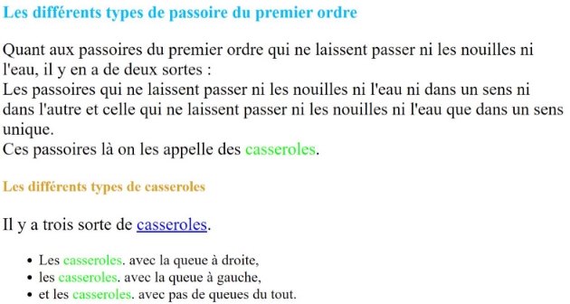
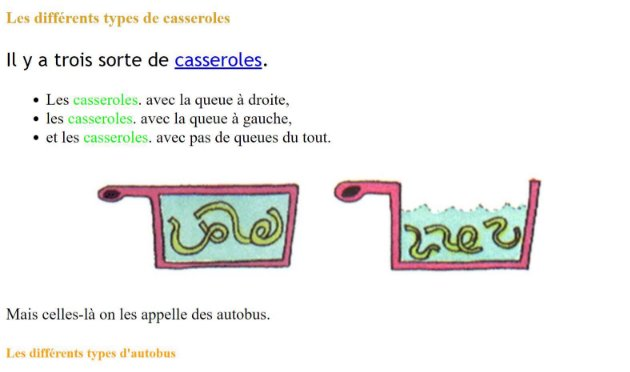
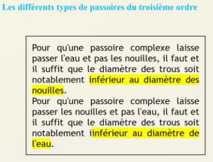

---
author: ELP
title: 07b Le CSS
--- 

**Table des matières** 

1. [La petite histoire du CSS ](#_page0_x40.00_y671.92)
2. [Ou écrit-on le CSS ? ](#_page1_x40.00_y36.92)
3. [Appliquer un style](#_page1_x40.00_y534.92)
4. [Formater du texte](#_page4_x40.00_y36.92)
5. [Ajouter de la couleur et un fond](#_page6_x40.00_y36.92)
6. [Habillage](#_page8_x40.00_y542.92)
7. [Créer des bordures et des ombres](#_page9_x40.00_y302.92)
8. [Les apparences dynamiques](#_page10_x40.00_y621.92)
9. [Les tableaux](#_page11_x40.00_y351.92)
10. [Le modèle des boites](#_page13_x40.00_y36.92)
11. [Le positionnement](#_page15_x40.00_y36.92)
12. [Squelette de base HTML – CSS8](#_page17_x40.00_y239.92)


## **1. La<a name="_page0_x40.00_y671.92"></a> petite histoire du CSS** 

CSS (**Cascading Style Sheets**), permet de choisir la couleur du texte, la police utilisée, la taille du texte, les bordures, le fond… et de faire la mise en page du site (menu à gauche, en-tête calé en haut, etc). 

Aux débuts du Web, CSS n'existait pas, il n'y avait initialement que le langage HTML. Cependant, les pages HTML commençaient à devenir assez complexes. Il y avait de plus en plus de balises et c'était un joyeux mélange entre le fond et la forme, qui rendait la mise à jour des pages web de plus en plus complexe. C'est pour cela que l'on a créé le langage CSS. 

## **2. Ou<a name="_page1_x40.00_y36.92"></a> écrit-on le CSS ?  **

On peut écrire du code en langage CSS à trois endroits différents :  

- dans un fichier .css (méthode la plus recommandée) ;  
- dans l'en-tête ```<head>``` du fichier HTML ;  
- directement dans les balises du fichier HTML via un attribut style  (méthode **la moins recommandée).**  

Nous écrirons le langage CSS dans un fichier style.css. On place ce fichier dans un dossier css dans le dossier Documents\site. 

**Activité n°1.:** Dans la index.html rajouter le lien vers le fichier css. 

```html
<!DOCTYPE html>

<html>
    <head>
        <meta charset="utf-8" />
        <link rel="stylesheet" href="css/style.css" />
        <title>Logique sur les passoires</title>
    </head>
``` 

Créer un nouveau fichier vide avec l’éditeur. Enregistrer-le dans le dossier css sous le nom style.css et entrer le code ci-dessous 


Enregistrer et observer la index.html dans Firefox. 

**Activité n°2.:** Dans la page2.html rajouter le lien vers le fichier css. 
```html
    <link rel="stylesheet" href="css/style.css" />
``` 


**Activité n°3.:** Faire un lien également vers le fichier style.css depuis la page3.html. **Attention** à bien retrouver le chemin relatif. 

Enregistrer et observer les page2.html et page3.html. 

On note un avantage du CSS, il ne suffit que d’écrire cette instruction qu’une seule fois pour tout le site !! et en cas de changement de style tous les fichiers seront changés en même temps. 

## **3. Appliquer<a name="_page1_x40.00_y534.92"></a> un style**  

Dans un code CSS, on trouve trois éléments différents : 

- Des noms de balises : on écrit des noms des balises dont on veut modifier l’apparence. Pour modifier l’apparence de tous les paragraphes ```<p>``` on doit écrire p. 
- Des propriétés CSS : les effets de style de la page sont rangés dans des propriétés.  Par exemple color ou font-size 

- Les valeurs : le nom de la couleur ou la taille de la police 

Par exemple : 
```css
balise1
{
    propriete1: valeur1;
}

balise2
{
    propriete1: valeur1;
    propriete2: valeur2;
    propriete3: valeur3;
    propriete4: valeur4;
}
```


On peut mettre autant de propriétés que l'on veut à l'intérieur **des accolades.** Chaque propriété est suivie du symbole « deux-points » ( : ) puis de la valeur correspondante. Enfin, chaque ligne se termine par un point-virgule ( ; ). 

### **3.1. Sélectionner<a name="_page2_x40.00_y67.92"></a> une balise**

**Activité n°4.:** Avec la feuille de style modifier toutes les couleurs des mots entre les balises ```<em>``` et ```<strong>```. 

```css
em
{
    color: red;
}
strong
{
    color : rgb(35, 241, 241) ;
}
```


**Activité n°5.:** Avec la feuille de style modifier toutes les couleurs des titres de la index h1, h2, h3, h4 et h5 

### **3.2. Les<a name="_page2_x40.00_y258.92"></a> commentaires** 

Les commentaires ne seront pas affichés, ils servent simplement à indiquer des informations. Taper ```/*```, suivi de votre commentaire, puis ```*/``` pour terminer votre commentaire. 

### **3.3. Class<a name="_page2_x40.00_y309.92"></a> et id** 

Ce qu’on vient de dire a un défaut : en appliquant une couleur aux paragraphes, tous les paragraphes possèdent la même présentation sur toutes les pages. 

On utilise alors des attributs spéciaux qui fonctionnent sur toutes les balises :  

- l’attribut class
- l’attribut id

#### **3.3.1. L’attribut<a name="_page2_x40.00_y406.92"></a> class**

C’est un attribut que l’on peut mettre dans toutes les balises 

```html
<h1 class=""> </h1> 
<p class=""> </p> 

```


Entre les doubles cotes on associe un nom. 

**Activité n°6.:** Mettre des balises p autour du **théorème** de la index.html. 

```html
    <p class ="theoreme"> …………………………………………..</p>
```


Puis dans la feuille de style rajouter 

```css
.theoreme
{
    color : red
}
```

Enregistrer tout et observer dans Firefox. 

Noter que le nom de la class doit se noter **avec un point en CSS**. 

#### **3.3.2. L’attribut<a name="_page2_x40.00_y639.92"></a> id** 

L’attribut id est utilisé exactement de la même manière que l’attribut class. La différence est qu’il ne pourra être utilisé **qu’une seule fois par page.**  

Par exemple id = "tata" => 1 seul fois mais id = "titi"  pourra aussi être utilisé sur la même page. Habituellement, on ne met un attribut id qu’à quelque chose d’unique sur la page, **par exemple le logo ou l’introduction** 

En CSS un id doit etre précéder d’un # 
```css
#logo 
{ 
/* Indiquez les propriétés CSS ici */ 
}
```


### **3.4. Les<a name="_page3_x40.00_y36.92"></a> balises universelles** 

Pour le theorème de l’activité précédente, il a fallu rajouter des balises p. Or il existe des balises qui ne servent à rien : 

- ```<span> </span>``` c’est une balise inline c’est-à-dire que l’on place au sein d’un paragraphe de texte, pour sélectionner certains mots uniquement  
- ```<div> </div>``` c’est une balise block qui entoure un bloc de texte. Elles créent un nouveau bloc dans la page et provoquent donc obligatoirement un retour à la ligne.  

**Activité n°7.:** Modifier la index et la feuille de style pour que l’on puisse voir cela : 


### **3.5. Les<a name="_page3_x40.00_y425.92"></a> sélecteurs avancés** 
- ```*``` est un sélecteur universelle il sélectionne toutes les balises sans exception. 
```css
*
{
}
```
 

- une balise dans une autre : par exemple toutes les balises ```<em>``` **situées à l’intérieur** d’une balise ```<h3>```

```css
h3 em
{
}
```
 

- La balise qui suit une autre : par exemple la première balise ```<p>``` **située après** un titre ```<h3>```
```css
h3 + p
{
}
```


- Une balise possédant un attribut : Sélectionne tous les liens ```<a>``` qui possèdent un **attribut** title.
```css
a[title]
{ 
} 
```
Ce style sera sur : 
```html
<a href="http://site.com" title="Infobulle"> 
```
- Etc … pour une liste complète :[ site du W3C ](https://www.w3.org/Style/CSS-selectors-updates/WD-CSS-selectors-20010126.fr.html#selectors)

## **4. Formater<a name="_page4_x40.00_y36.92"></a> du texte** 
### **4.1. Taille<a name="_page4_x40.00_y58.92"></a>** 

On utilise la propriété font-size* avec deux techniques pour définir la taille : 

- La taille absolue : en pixels, en cm ou en mm 
- La taille relative : en % , ou nom (small, large, xx-large) ou nombre relatif (1em, 1.3em, 0.8em) qui permet de s’adapter à la taille des visiteurs 
```css
balise 
{ 
    font-size: 16px; 
} 
```

**Activité n°8.:** Modifier la feuille de style pour que les paragraphes est une taille de 120% 



### **4.2. La<a name="_page4_x40.00_y513.92"></a> police** 

C’est la propriété font-family. On peut définir plusieurs polices pour éviter des problèmes de compatibilité chez l’internaute.  
```css
balise 
{ 
    font-family: police1, police2, police3, police4; 
} 
```

Les polices qui fonctionnent sur la plupart des navigateurs : Arial ; Arial Black ; Comic Sans MS ; Courier New ; Georgia ; Impact ; Times New Roman ; Trebuchet MS ; Verdana. 

Il est possible d’utiliser des polices personnalisées que l’internaute téléchargera automatiquement lors de la visite du site. 

**Activité n°9.:** Modifier la feuille de style pour que les paragraphes est une police en Trebuchet MS. 


### **4.3. Italique,<a name="_page5_x40.00_y342.92"></a> gras, souligné** 

- la propriété ```font-style : normal, italic``` 
- la propriété ```font-weight : normal, bold```
- Le soulignement se traite avec ```text-decoration : underline*,* ou none```

### **4.4. L’alignement<a name="_page5_x40.00_y410.92"></a>** 

On utilise la propriété ```text-align : left``` ou ```center``` ou ```right``` ou ```justify```

**Activité n°10.:** Modifier la feuille de style pour que les paragraphes soient justifiés et centré les images (penser à mettre des nom aux balises des images sur la index) 



## **5. Ajouter<a name="_page6_x40.00_y36.92"></a> de la couleur et un fond** 
### **5.1. La<a name="_page6_x40.00_y58.92"></a> couleur du texte** 

On utilise la propriété color suivie   

- Du nom de la couleur : white, silver, gray, red, green, blue, fuchsia, purple*…* 
- De son code hecadécimal : #FF5A28*, …[* https://htmlcolorcodes.com/fr/ ](https://htmlcolorcodes.com/fr/)*ou[ http://www.colorpicker.com/ ](http://www.colorpicker.com/)
- De son code rgb : rgb(240,96,204)*….[ https://htmlcolorcodes.com/fr/ ](https://htmlcolorcodes.com/fr/)*ou[ http://www.colorpicker.com/ ](http://www.colorpicker.com/)


### **5.2. Arrière<a name="_page6_x40.00_y498.92"></a> plan** 

La propriété CSS background est une propriété raccourcie qui permet de définir les différentes valeurs des propriétés liées à la gestion des arrière-plans d'un élément (couleur, image, origine, taille, répétition, etc.). 

#### **5.2.1. Couleur<a name="_page6_x40.00_y547.92"></a> de fond**

On utilise la propriété background-color avec les mêmes propriétés que color*.* Il faut mettre cette propriété sur body


**Activité n°11.:** La couleur de fond d'une page est définie comme suit :  
```css
body
{
    background-color: lightblue;
}
```


Modifier la feuille de style pour que la couleur de fond soit #F3E0C5 
```css
body
{
    background-color: #F3E0C5
}
```
 

Modifier la feuille de style pour que la couleur de fond soit rgb(255,0,0) 
```css
body
{
    background-color: rgb(255,0,0)
}
```
 

Il existe aussi un niveau de transparence avec la notation RGBa. Par exemple :  
```css
p
{
    background-color: rgba(255, 0, 0, 0.5); /* Fond rouge à moitié transparent */
}
``` 


#### **5.2.2. Images<a name="_page7_x40.00_y91.92"></a> de fond**

La propriété permettant d'indiquer une image de fond est ```background-image```. Comme valeur, on doit renseigner ```url("nom_de_l_image.png")```

**Activité n°12.:** Choisir une image neutre sur internet que l’on appelera paper.gif et modifier la feuille de style pour y mettre une image de fond sous forme d’url 
```css
body
{
    background-image: url("paper.gif");
```


##### **5.2.2.1. Répétition d’arrière plan**

Par défaut, la background-image propriété répète une image à la fois horizontalement et verticalement. 

Certaines images doivent être répétées uniquement horizontalement ou verticalement, sinon elles auront l'air étrange, comme ceci 

```css
body
{
    background-image: url("paper.gif");
    background-repeat: repeat-x;
}
```


Le ```background-repeat```: répétition du fond. Par défaut, l'image de fond est répétée en mosaïque 

- ```no-repeat```: le fond ne sera pas répété. L'image sera donc unique sur la page. 
- ```repeat-x```: le fond sera répété uniquement sur la première ligne, horizontalement. 
- ```repeat-y```: le fond sera répété uniquement sur la première colonne, verticalement. 
- ```repeat```: le fond sera répété en mosaïque (par défaut). 

##### **5.2.2.2. Position d’arrière plan**

La ```background-position``` propriété est utilisée pour spécifier la position de l'image d'arrière-plan. 
```css
body
{
    background-image: url("paper.gif");
    background-repeat: repeat-x;
    background-position: right top;
}
```


Le ```background-position``` permet d’indiquer la position du fond par rapport au coin supérieur gauche de la page ou les mots clé ```top, bottom, left```… 

##### **5.2.2.3. Fixe ou scroll de l’arrière plan** 

La ```background-attachment``` propriété spécifie si l'image d'arrière-plan doit défiler ou être fixe (ne défile pas avec le reste de la page) 
```css
body
{
    background-image: url("paper.gif");
    background-repeat: repeat-x;
    background-position: right top;
     background-attachment: scroll;
}
```


Le ```background-attachment```: fixer le fond. Deux valeurs sont disponibles :  

- ```fixed```: l'image de fond reste fixe ; 
- ```scroll```: l'image de fond défile avec le texte (par défaut).

##### **5.2.2.4. Propriétés de l’arrière plan abrégée** 

Pour raccourcir le code, il est également possible de spécifier toutes les propriétés du fond dans une seule propriété. C'est ce qu'on appelle une propriété abrégée. 

```css
body {
    background-color: #ffffff;
    background-image: url("img_tree.png");
    background-repeat: no-repeat;
    background-position: right top;
}
```


On peut écrire une propriété abrégée dans une seule déclaration 

```css
body {
    background: #ffffff url("img_tree.png") no-repeat right top;
  }
```


##### **5.2.2.5. Plusieurs images** 

Depuis CSS, il est possible de donner plusieurs images de fond à un élément. Pour cela, il suffit de séparer les déclarations par une virgule, comme ceci : 

```css
body
{
    background: url("soleil.png") fixed no-repeat top right, url("neige.png") fixed;
}
```


La première image de cette liste sera placée par-dessus les autres. Attention donc, l'ordre de déclaration des images a son importance : si vous inversez le soleil et la neige dans le code CSS précédent, vous ne verrez plus le soleil ! 

## **6. Habillage<a name="_page8_x40.00_y542.92"></a>** 


Le CSS permet de faire flotter un élément autour d'un texte grâce à la propriété CSS ```float```. 

- ```left``` : l'élément flottera à gauche. 
- ```right``` : l'élément flottera à droite.
```html
<p>
    
</p>
```
```css
.imageflottante
{
    float: left;
}
```


Pour ne plus faire flotter l'élément, il faut utiliser la propriété clear, qui peut prendre ces trois valeurs : 

- ```left``` : le texte se poursuit en-dessous après un ```float: left```;
- ```right``` : le texte se poursuit en-dessous après un ```float: right```;
- ```both``` : le texte se poursuit en-dessous, que ce soit après un ```float: left```; ou après un ```float: right```;. 
```html
<p></p>
<p>Texte écrit à côté de l'image.</p>
<p class="dessous">Texte écrit sous l'image.</p>  
```
```css
.imageflottante
{
    float: left;
}
.dessous
{
    clear: both;
}
```  


## **7. Créer<a name="_page9_x40.00_y302.92"></a> des bordures et des ombres** 
### **7.1. Bordures<a name="_page9_x40.00_y324.92"></a> standard** 

Pour ```border``` on peut utiliser jusqu'à trois valeurs pour modifier l'apparence de la bordure : 

- **La largeur** : indiquez la largeur de votre bordure. Mettez une valeur en pixels (comme ```2px```). 
- **La couleur** : c'est la couleur de votre bordure. Utilisez, comme on l'a appris, soit un nom de couleur (black,red,…), soit une valeur hexadécimale (```#FF0000```), soit une valeur RGB (```rgb(198, 212, 37)```). 
- **Le type de bordure** : là, vous avez le choix. Votre bordure peut être un simple trait, ou des pointillés, ou encore des tirets, etc. Voici les différentes valeurs disponibles : 
```none```: pas de bordure (par défaut) ; 
 ```solid```: un trait simple ; 
 ```dotted```: pointillés ; 
 ```double```: bordure double ; 
 *etc* 


Ainsi, pour avoir une bordure bleue, en tirets, épaisse de 3 pixels autour de mes titres, je vais écrire : 

```css
h1
{
    border: 3px blue dashed;
}
```

 

Des bordures différentes en fonction du côté : 

- ```border-top```: bordure du haut ; 
- ```border-bottom```: bordure du bas ; 
- ```border-left```: bordure de gauche ; 
- ```border-right```: bordure de droite. 

### **7.2. Bordures<a name="_page10_x40.00_y115.92"></a> arrondies** 

La propriété ```border-radius``` va nous permettre d'arrondir facilement les angles de n'importe quel élément. Il suffit d'indiquer la taille (« l'importance ») de l'arrondi en pixels, par exemple : ```border-radius : 10px```; 

**Activité n°13.:** Modifier la feuille de style pour que le théorème soit entouré d’une bordure arrondie, d’une couleur, de style de traits et d’épaisseur au choix. Centrer le théorème. 


### **7.3. Les<a name="_page10_x40.00_y299.92"></a> ombres** 

Il est possible de mettre des ombres portés sur : 

- Des boites : la propriété ```box-shadow``` s'applique à tout le bloc et prend quatre valeurs dans l'ordre suivant 

le décalage horizontal de l'ombre ; 
le décalage vertical de l'ombre ; 
L’adoucissement du dégradé ; 
la couleur de l'ombre. 

Par exemple, pour une ombre noire de 6 pixels, sans adoucissement, on écrira :   
```css
p
{
    box-shadow: 6px 6px 0px black;
}
```


- du texte : avec ```text-shadow```  qui a le même fonctionnement 

**Activité n°14.:** Modifier la feuille de style pour que le théorème est une ombre portée sur sa bordure. 


## **8. Les<a name="_page10_x40.00_y621.92"></a> apparences dynamiques** 

En CSS, on peut modifier l'apparence de certaines sections dynamiquement, après le chargement de la page, lorsque certains évènements se produisent. On utilise pour cela les pseudo-formats. 

- ```:hover``` permet de changer l'apparence au survol (par exemple : a:hover pour modifier l'apparence des liens lorsque la souris pointe dessus). 
- ```:active``` applique un style particulier au moment du clic. En pratique, il n'est utilisé que sur les liens. 
- ```:focus``` applique un style lorsque l'élément est sélectionné. 
- ```:visited``` applique un style à un lien vers une page qui a déjà été vue. 

### **8.1. Au<a name="_page11_x40.00_y36.92"></a> survol** 

Lorsque la souris survole quelque chose on peut prévoir un style différent. Par exemple : 

```css
a /* Liens par défaut (non survolés) */
{
   text-decoration: none;
   color: red;
   font-style: italic;
}

a:hover /* Apparence au survol des liens */
{
   text-decoration: underline;
   color: green;
}
```


### **8.2. Au<a name="_page11_x40.00_y195.92"></a> clic** 

On peut par exemple changer la couleur de fond du lien lorsque l'on clique dessus : 
```css
a:active /* Quand le visiteur clique sur le lien */
{
    background-color: #FFCC66;
}
```


### **8.3. Le<a name="_page11_x40.00_y276.92"></a> lien déjà visité** 

On peut changer cette apparence avec: *visited* (qui signifie « visité »).  
```css
a:visited /* Quand le visiteur a déjà vu la page concernée */
{
    color: #AAA; /* Appliquer une couleur grise */
}
```


## **9. Les<a name="_page11_x40.00_y351.92"></a> tableaux** 
### **9.1. Un<a name="_page11_x40.00_y389.92"></a> tableau simple** 

On utilise la balise ```<table></table>```. Puis il faut indiquer le début et la fin de chaque ligne : ```<tr></tr>```. A l’intérieur de chaque ligne, il faut définir toutes les cellules avec ```<td></td>```. 

Par exemple : 
```html
<table>
   <tr>
       <td>Carmen</td>
       <td>33 ans</td>
       <td>Espagne</td>
   </tr>
   <tr>
       <td>Michelle</td>
       <td>26 ans</td>
       <td>États-Unis</td>
   </tr>
</table>
```


Il faut prendre le soin d’indiquer le type de bordure pour les cellules et/ou les lignes dans la feuille de style css. Par exemple : 

```css
table 
{ 
border-collapse: collapse; /* Les bordures du tableau seront collées (plus joli) */ 
} 
td 
{ 
border: 1px solid black; 
}
```

table  

{  

*border-collapse*: collapse; /\* Les bordures du tableau seront collées (plus joli) \*/  }  

td  

{  

*border*: 1px solid black;  

} 

### **9.2. L’en<a name="_page11_x40.00_y705.92"></a> tête** 

La ligne d'en-tête est très facile à reconnaître pour deux raisons : 

- les cellules sont des <th> au lieu des <td>* habituels ; 
- c'est la première ligne du tableau 
### **9.3. Titre<a name="_page12_x40.00_y36.92"></a> du tableau** 

Il est à mettre dans la balise*  <caption></caption>*  juste après la balise <table>

On peut changer la position du titre avec la propriété CSS caption-side qui peut prendre deux valeurs : 

- top: le titre sera placé au-dessus du tableau (par défaut) ; 
- bottom: le titre sera placé en dessous du tableau.

### **9.4. Gros<a name="_page12_x40.00_y120.92"></a> tableau  **

Il existe des balises HTML qui permettent de  définir les trois « zones » du tableau :  

- l'en-tête (en haut) : il se définit avec  les balises <thead></thead>; 
- le corps (au centre) : il se définit avec  les balises* <tbody></tbody>;   
- le  pied  du  tableau  (en  bas)  :  il  se  définit  avec  les  balises  <tfoot></tfoot>*.*  

### **9.5. Fusionner<a name="_page12_x40.00_y268.92"></a>**   
- La fusion de colonnes : c'est ce que je viens de faire dans cet exemple. La fusion s'effectue horizontalement. On utilisera l'attribut colspan.
- La fusion de lignes : là, deux lignes seront groupées entre elles. La fusion s'effectuera verticalement. On utilisera l'attribut rowspan.

Par exemple :

<table> 

`   `<tr> 

`       `<th>Titre du film</th> 

`       `<th>Pour enfants ?</th> 

`       `<th>Pour adolescents ?</th> 

`   `</tr> 

`   `<tr> 

`       `<td>Massacre à la tronçonneuse</td> 

`       `<td >Non, trop violent</td> 

`       `<td>Oui</td> 

`   `</tr> 

`   `<tr> 

`       `<td>Les bisounours font du ski</td> 

`       `<td>Oui, adapté</td> 

`       `<td>Pas assez violent...</td> 

`   `</tr> 

`   `<tr> 

`       `<td>Lucky Luke, seul contre tous</td> 

`       `<td colspan="2">Pour toute la famille !</td>    </tr> 

</table> 


**Activité n°15.:** Rajouter un tableau résumé à la fin de la index. Modifier la feuille de style pour que le tableau ressemble à l’image ci-dessous. Penser à nommer les balise pour les utiliser en css. 

## **10. Le<a name="_page13_x40.00_y36.92"></a> modèle des boites** 

Dans une mise en page réalisée en CSS, tous les éléments sont considérés comme des boîtes. Chacune de ces boîtes est constituée d’un contenu, d’un espacement intérieur, d’une bordure, et d’une marge externe. 

Voici les  propriétés  CSS  qui  permettent  de  déterminer  les  dimensions, la  couleur,  le style  de chacun  de  ses constituants : 


|**Propriété CSS** |**Ce qui est concerné :** |
| - | - |
|width et height |largeur et hauteur du contenu (texte, image, etc.) |
|padding |espacement intérieur, entre le contenu et la bordure |
|border |bordure (ou encadrement) |
|margin |marge externe, espace (transparent) entourant le tout |

` `

- width : c'est la largeur du bloc exprimé en pixels (px) ou en pourcentage (%). 
- height : c'est la hauteur du bloc exprimé en pixels (px) ou en pourcentage (%). 
- padding : indique la taille de la marge intérieure en pixels (px). 
- margin : indique la taille de la marge extérieure en pixels (px). 
1. Un bloc peut avoir des dimensions minimales et maximales : 
- min-width : largeur minimale ; 
- min-height : hauteur minimale ; 
- max-width : largeur maximale ; 
- max-height : hauteur maximale. 
2. Les marges extérieures peuvent avoir des valeurs différentes : 
- margin-top : marge extérieure en haut ; 
- margin-bottom : marge extérieure en bas ; 
- margin-left : marge extérieure à gauche ; 
- margin-right : marge extérieure à droite. 
3. Idem pour les marges intérieures ! 

Exemple : 

p 

{ 

`   `width: 350px; 

`   `border: 1px solid black;    text-align: justify; 

`   `padding: 12px; 

`   `margin: 50px; /\* Marge extérieure de 50px \*/ } 



Remarque : utiliser la propriété margin: auto pour centrer des blocs. Pour cela, il faut obligatoirement donner une largeur au bloc (avec la propriété width). 

Exemple : 

p 

{ 

`    `width: 350px; /\* On a indiqué une largeur (obligatoire) \*/ 

`    `margin: auto; /\* On peut donc demander à ce que le bloc soit centré avec auto \*/ } 


Si vous voulez que le texte ne dépasse pas des limites du bloc, il va falloir utiliser la propriété overflow. Voici les valeurs qu'elle peut accepter : 

- visible (par défaut) : si le texte dépasse les limites de taille, il reste visible et sort volontairement du bloc. 
- hidden : si le texte dépasse les limites, il sera tout simplement coupé. On ne pourra pas voir tout le texte. 
- scroll : le texte sera coupé s'il dépasse les limites. Sauf que cette fois, le navigateur mettra en place des barres de défilement pour qu'on puisse lire l'ensemble du texte. 
- auto : le navigateur décide de mettre ou non des barres de défilement. 

Remarque : la propriété word-wrap: break-word permet de forcer la césure des très longs mots (généralement des adresses un peu longues). 

## **11. Le<a name="_page15_x40.00_y36.92"></a> positionnement** 
### **11.1. **Les<a name="_page15_x40.00_y58.92"></a> positionnements absolu, fixe et relatif** 

La propriété CSS position permet de positionner avec précision des éléments sur la page. Pour cela, on lui donne une de ces valeurs : 

- absolute : positionnement absolu ; il permet de placer un élément n'importe où sur la page (en haut à gauche, en bas à droite, tout au centre, etc.). 
- fixed : positionnement fixe ; identique au positionnement absolu mais, cette fois, l'élément reste toujours visible, même si on descend plus bas dans la page. 
- relative : positionnement relatif ; ce positionnement permet d'effectuer des « ajustements » : l'élément est décalé par rapport à sa position initiale. 

Si un bloc est positionné en absolu, il faut indiquer au navigateur où le positionner sur la page à l'aide des quatre propriétés CSS : 

- left : position par rapport à la gauche de la page ; 
- right : position par rapport à la droite de la page ; 
- top : position par rapport au haut de la page ; 
- bottom : position par rapport au bas de la 

page. 

Exemple : 

element 

{ 

`    `position: absolute;     right: 0px; 

`    `bottom: 0px; 

} 

Remarque : les éléments positionnés en absolu sont placés par- dessus le reste des éléments de la page ! Par ailleurs, si vous placez deux éléments en absolu vers le même endroit, ils risquent de se chevaucher.  Dans  ce  cas,  utilisez  la  propriété z-index  pour indiquer quel élément doit apparaître au-dessus des autres. 

L'élément ayant la valeur de z-index la plus élevée sera placé par-dessus les autres, comme le montre la figure ci-contre. 

### **11.2. Le<a name="_page15_x40.00_y697.92"></a> positionnement inline-block** 

En CSS la propriété display permet de transformer n'importe quel élément de la page d'un type vers un autre et les faire apparaître sous forme de blocs. À ce moment-là, les éléments vont se positionner les uns en-dessous des autres et il devient possible de modifier leurs dimensions ! 

Voici quelques-unes des principales valeurs que peut prendre la propriété display : 

|**Valeur** |**Exemples** |**Description** |
| - | - | - |
|inline |<a>, <em>, <span>…|Eléments d'une ligne. Se placent les uns à côté des autres. |
|block |<p>, <div>, <section>… |Eléments en forme de blocs. Se placent les uns en-dessous des autres et peuvent être redimensionnés. |
|inline-block |<select>, <input> |Eléments positionnés les uns à côté des autres (comme les inlines) mais qui peuvent être redimensionnés (comme les blocs). |
|none |<head> |Eléments non affichés. |

Les éléments en inline-block nous permet d'utiliser la propriété vertical-align. Cette propriété permet de modifier l'alignement vertical des éléments. Voici quelques-unes des valeurs possibles pour cette propriété : 

- baseline : aligne de la base de l'élément avec celle de l'élément parent (par défaut) ; 
- top : aligne en haut ; 
- middle : centre verticalement ; 
- bottom : aligne en bas ;  
- (valeur en px ou %) : aligne à une certaine distance de la ligne de base (baseline). 

NB : les éléments inline-block se positionnent sur une même ligne de base (appelée baseline), en bas. Exemple : nous voulons réaliser la page suivante.  

Donnons le code HTML correspondant...  

<!DOCTYPE html>  

<html>  

`    `<head>  

`        `<meta charset="utf-8" />  

`        `<link rel="stylesheet" href="style.css" />          <title>Zozor - Le Site Web</title>  

`    `</head>  

`    `<body>  

`        `<header>  

`            `<h1>Zozor</h1>  

`            `<h2>Carnets de voyage</h2>  

`        `</header> 

`        `<nav> 

`            `<ul> 

`                `<li><a href="accueil.html">Accueil</a></li>                 <li><a href="blog.html">Blog</a></li> 

`                `<li><a href="cv.html">CV</a></li> 

`            `</ul> 

`        `</nav> 

`        `<section> 

`            `<aside> 

`                `<h1>À propos de l'auteur</h1> 

`                `<p>C'est moi, Zozor ! Je suis né un 23 novembre 2005.</p>             </aside> 

`            `<article>                 

`                `<h1>Je suis un grand voyageur</h1> 

`                `<p>Bla bla bla bla (texte de l'article)</p> 

`            `</article> 

`        `</section> 

`        `<footer> 

`            `<p>Copyright Zozor - Tous droits réservés 

`            `<a href="mailto:zorro@monsite.org">Me contacter !</a></p>         </footer> 

`    `</body> 

</html> 

Première NSI   Chap 18 : Le CSS  Page 18/19 

...et le code CSS associé. 

nav 

{ 

`    `display: inline-block; 

`    `width: 150px; 

`    `border: 1px solid black;     vertical-align: top; 

} 

section 

{ 

`    `display: inline-block;         border: 1px solid blue; 

`    `vertical-align: top; 

} 

## **12. Squelette<a name="_page17_x40.00_y239.92"></a> de base HTML – CSS** 

Le squelette d’une page web possède souvent une structure de base à cinq blocs principaux. 


Cette structure de base à cinq blocs principaux convient dans la majorité des cas, car elle permet de fabriquer une grande variété de mises en page. 

 **HTML   CSS  **

- <!DOCTYPE html>  /\* Mes styles \*/  <html>  

<head>  .header {….}  

- <title>Titre de la page</title>   
- <link rel="stylesheet" href="style.css"/>  .nav {….}  </head>  

<body>  .content {….}  

`         `<div class="header">En-tête</div>  

- <div class="nav">Navigation</div>  .aside {….}  
- <div class="content">Contenu</div>            <div class="aside">Contexte</div>  .footer {….}  

`         `<div class="footer">Pied de page</div>  

- </body>   </html>   

Il existe sur le web des collections de modèles de mise en page, à télécharger gratuitement. Exemple : «[ Layout Gala ](http://blog.html.it/layoutgala/)» 
Première NSI   Chap 7 : Le CSS  Page 19/19 
